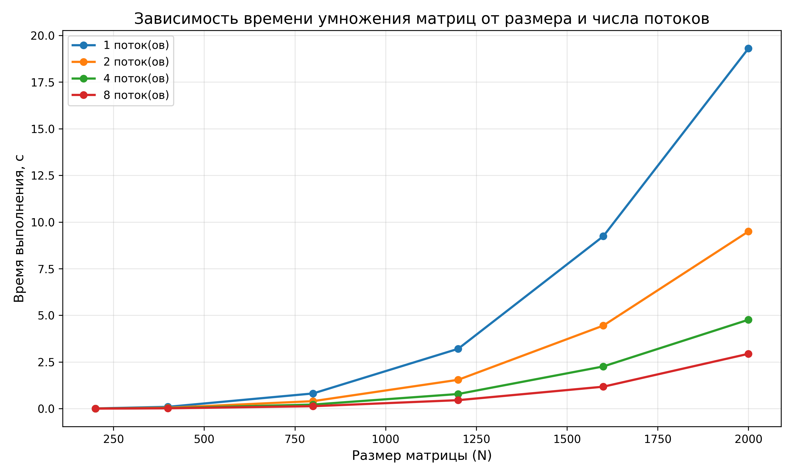
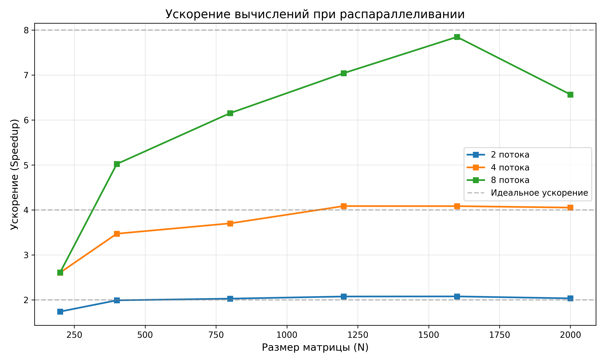

# Лабораторная работа №2: Параллельное перемножение матриц с OpenMP

**Студент:** [Жирнов Александр Александрович]  
**Группа:** [6201-120304D]  

---

##  Цель работы

Модифицировать программу из лабораторной работы №1 для параллельного умножения квадратных матриц с использованием технологии OpenMP. Исследовать влияние количества потоков на время выполнения и ускорение. Провести верификацию результатов.

---

##  Модификации программы

### 2.1. Добавление параллелизма с OpenMP

В программу добавлены:
- Подключение библиотеки `#include <omp.h>`
- Директива `#pragma omp parallel for` для распараллеливания внешнего цикла
- Функция `parallelMatMul()` с параметром количества потоков
- Использование `schedule(dynamic)` для динамического распределения итераций

### 2.2. Автоматизация экспериментов

Программа автоматически перебирает:
- **Размеры матриц:** 200, 400, 800, 1200, 1600, 2000
- **Количество потоков:** 1, 2, 4, 8

### 2.3. Сохранение данных

- Исходные матрицы: `A_N.txt` и `B_N.txt`
- Результаты: `C_N_threads.txt`
- Время выполнения: `timings_omp.csv`

---

##  Результаты

### Время выполнения

**Рисунок 1** — Зависимость времени умножения матриц от размера и числа потоков

### Ускорение вычислений

**Рисунок 2** — Ускорение вычислений при распараллеливании

---

## 📈 Анализ результатов

### По графику времени (Рис. 1):

- Время выполнения растёт нелинейно с увеличением размера матрицы (сложность O(N³))
- Параллельная реализация демонстрирует значительное сокращение времени:
  - **N=2000:** 19.3 с (1 поток) → 2.9 с (8 потоков)
  - **Ускорение:** ~6.5 раз

### По графику ускорения (Рис. 2):

| Потоки | Ускорение | Оценка |
|--------|-----------|--------|
| 2 | ~2.0× | Почти идеальное |
| 4 | ~4.0× | Линейное масштабирование |
| 8 | до 7.8× (N=1600) | Отличное |
| 8 | ~6.5× (N=2000) | Небольшое снижение |

### Объяснение результатов:

 **Линейное ускорение** для 2 и 4 потоков указывает на эффективное распараллеливание

 **Снижение эффективности** при 8 потоках для больших матриц объясняется:
- Конкуренцией потоков за доступ к оперативной памяти (memory bandwidth)
- Ограничениями кэш-памяти при работе с большими объёмами данных
- Накладными расходами на синхронизацию потоков

---

##  Выводы

Параллельная реализация умножения матриц с использованием технологии OpenMP продемонстрировала высокую эффективность:

1.  Достигнуто **ускорение до 7.8×** при использовании 8 потоков (N=1600)
2.  Для малых матриц (N≤400) накладные расходы снижают эффективность (соответствует теории)
3.  Алгоритм **хорошо масштабируется** на многопоточных системах
4.  Верификация подтвердила **корректность** параллельной реализации
5.  Эффективность ограничивается **пропускной способностью памяти**

